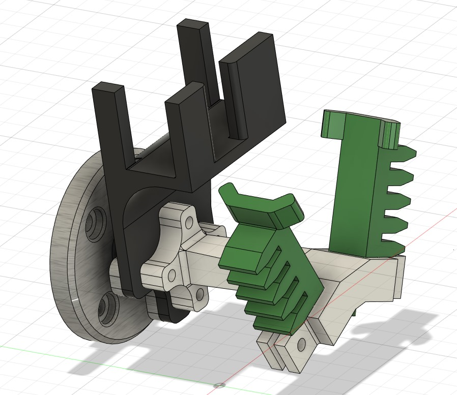
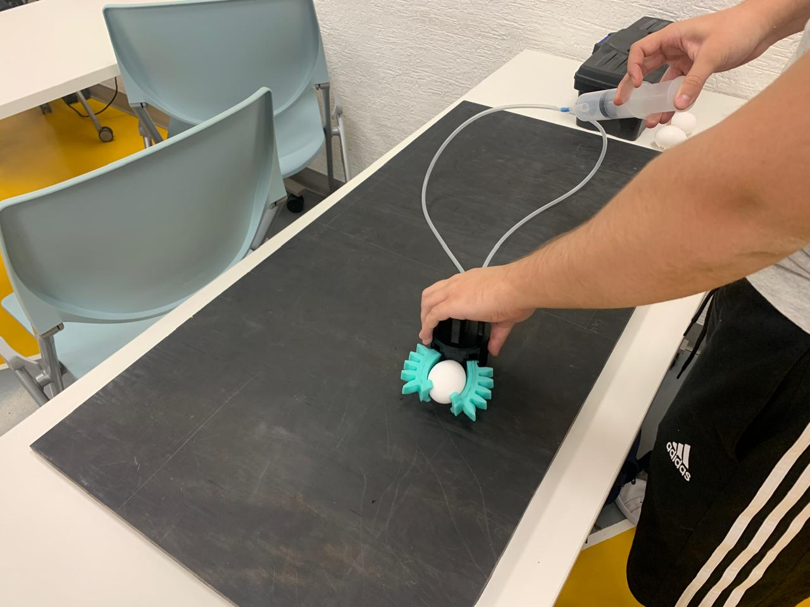
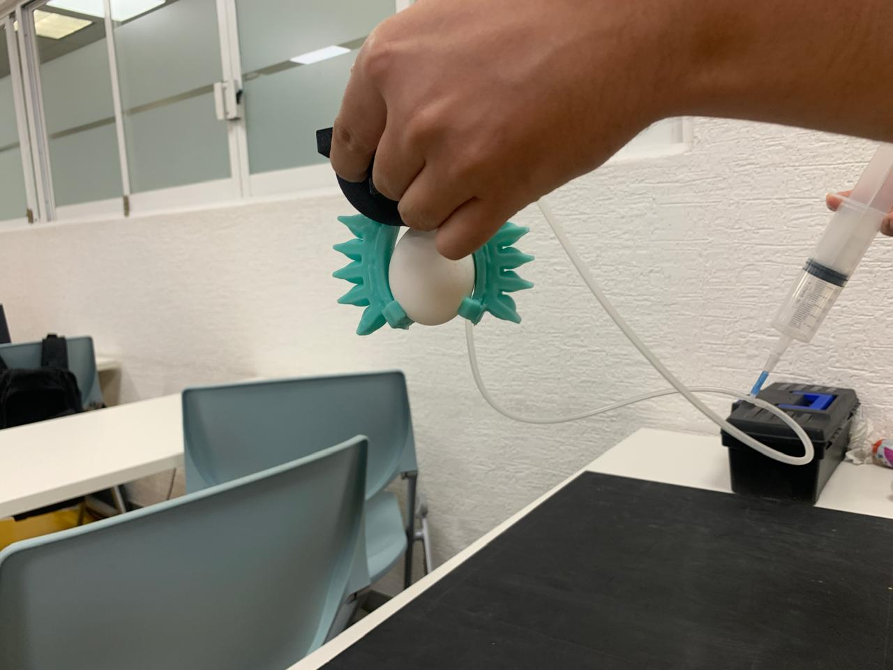
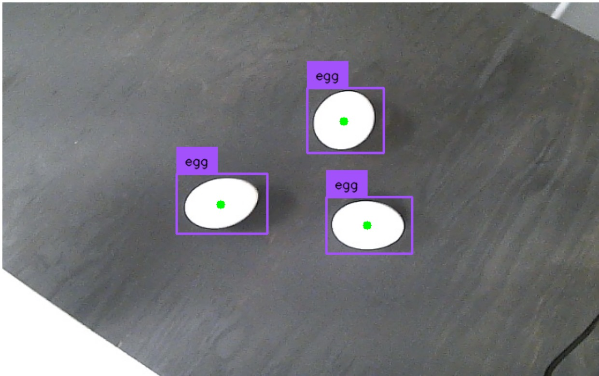
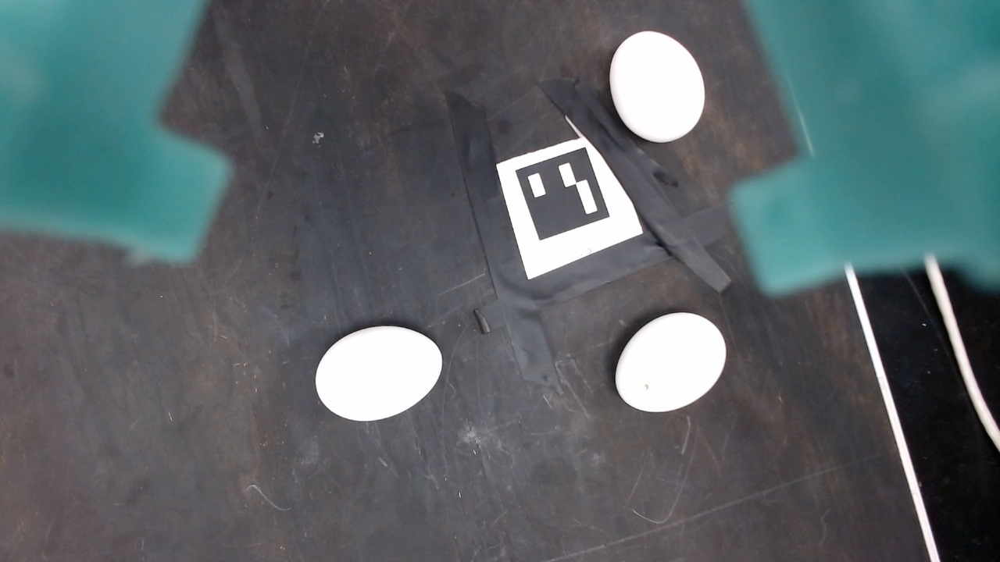
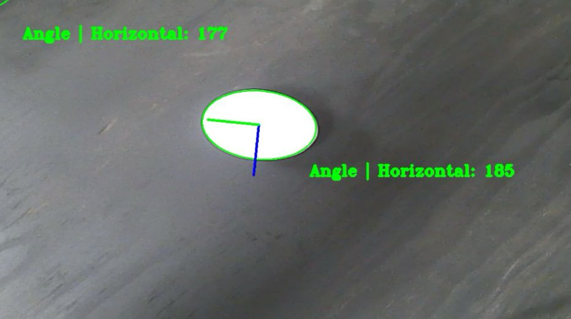
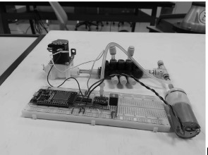

# Cyberphysical Systems

## Project description

The goal is to develop a soft gripper and it's tools to include computer vision and 4.0 industry concepts. 

Therefore the path was to create a solution to handle fragile objects (in this case eggs). 

## Topics:

- Colaborative Robotics: RoboDK & ISO regulations 
- Digital communications: MQTT & LoRA
- Computer Vision: Object detection
- Soft Robotics: CAD design, elastomers & gripper desing
- Control: Models

## Solution 

To complete the project and present it to Universal Robots and at "Expo Ingenierias" we designed the next components/solutions:

- Soft Gripper: Manufactured with elastomers & contolled neumatically
- Object detection: Yolo v8 trained network.
- 3D interpretation: Use of Arucos to calculate the position of the eggs with direct cinematics

### Gripper
 
                         

### Vision

 
                           

### Control 

